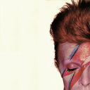
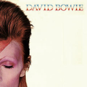
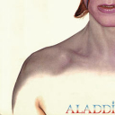
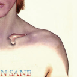

# Multemojis

#### A CLI tool for resizing and composing images to make Slack emojis and mosaics

### Features

- Support for  PNG, JPEG and BMP buffers. 
- Supports for reading images from URLs and file paths.
- Support for a single emoji or a mosaic of any dimensions

### Installing

`npm install -g multemojis`

OR

`yarn global add multemojis`

### Usage

`multemojis <PATH_TO_IMAGES OR URL> [options]`

If no `options` are specified, multemojis creates a single Slack emoji from your image

Option | Definition | Default
--- | --- | ---
height / -h |  how many emoji tiles high  | 1
width / -w |  how many emoji tiles wide  | 1
out / -o |  where to output emojis  | `<PATH_TO_IMAGES OR URL>`
| method / -m | how to scale images | [jimp](https://www.npmjs.com/package/jimp) `scaleToFit`

### Example

Compose a 2x2 emoji mosaic from this sweet David Bowie headshot and write it to `emojis/`

`multemojis http://legacy.davidbowie.com/wp-content/uploads/1973/04/aladdin-sane.jpg -w 2 -h 2 -o emojis/`

_______

See [Slack docs](https://get.slack.help/hc/en-us/articles/206870177-Create-custom-emoji) for uploading emojis to your workspace

## Contributing

Please feel free to open an [issue](https://github.com/AriLFrankel/multemojis/issues) for any contribution ideas

#### Built with [jimp](https://www.npmjs.com/package/jimp), [command-line-args](https://www.npmjs.com/package/command-line-args) and [command-line-usage](https://www.npmjs.com/package/command-line-usage) :pray:
